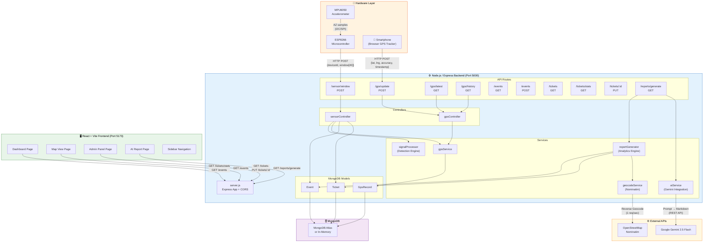
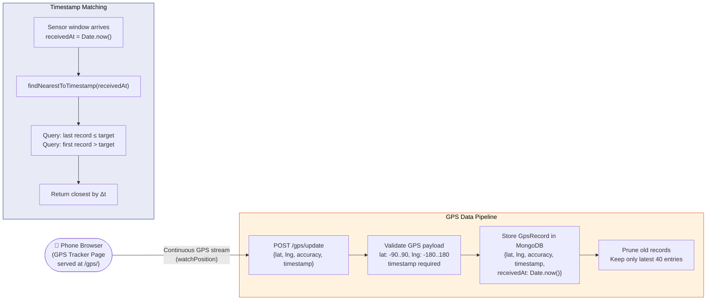
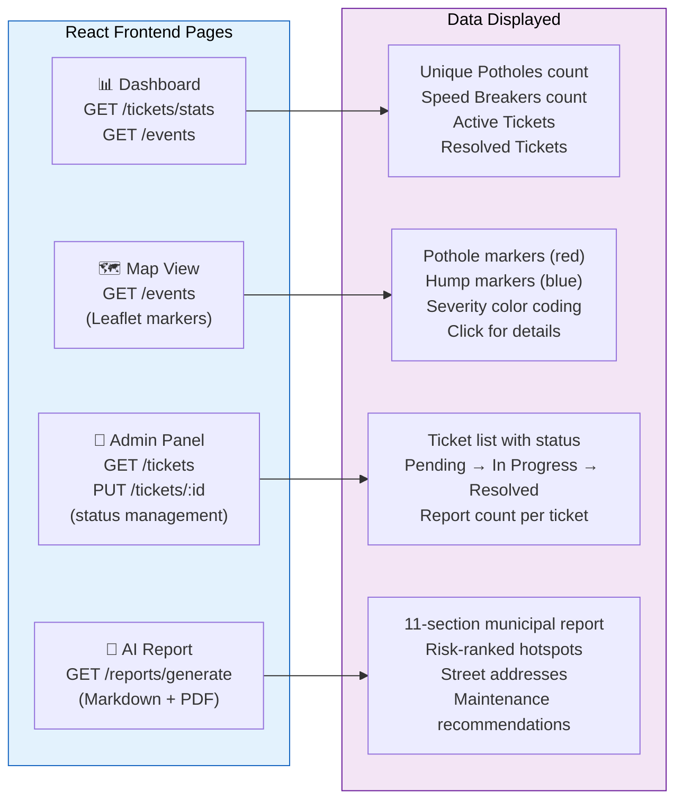

# IDP Project — Detailed System Flowchart (Mermaid)

Below are **three complementary Mermaid diagrams** that together capture the complete working of the project.

---

## 1. High-Level System Architecture

---

## 2. Sensor Ingestion & Signal Processing Pipeline (Detailed)

This is the core end-to-end flow — from an ESP8266 sensor window arriving to a classified event being persisted.

```mermaid
flowchart TD
    START(["ESP8266 sends POST /sensor/window<br/>{deviceId, window[40 AZ values]}"])

    T0["Record server-side<br/>receivedAt timestamp"]
    V1{"Validate Payload<br/>deviceId is string?<br/>window has ≥40 numbers?"}
    V1_FAIL["Return 400<br/>Validation Error"]

    subgraph SP["🧠 Signal Processing Engine (signalProcessor.js)"]
        direction TB
        S1["Step 1: Baseline Calibration<br/>Average first 5 samples<br/>baseline = mean(window[0..4])"]
        S2["Step 2: Signal Normalization<br/>relative[i] = window[i] − baseline<br/>(center signal around 0)"]
        S3["Step 3: Event Trigger Detection<br/>Find first index where 2 consecutive<br/>|relative[i]| ≥ EVENT_THRESHOLD (2.0 m/s²)"]
        S3_CHK{"Event<br/>Detected?"}
        S3_NO["Return: Smooth<br/>Severity: Low<br/>Confidence: 0"]
        S4["Step 4: Slice Analysis Window<br/>Extract 15 samples from event start"]
        S5["Step 5: Feature Extraction<br/>• Find positive peak & index<br/>• Find negative peak & index<br/>• Determine peak order (neg_first / pos_first)<br/>• Calculate peakTimeGap<br/>• Calculate peakDifference & peakRatio"]
        S6{"Step 6: Classification Rules"}
        S6A{"Both peaks<br/>below PEAK_THRESHOLD<br/>(4.0 m/s²)?"}
        S6B{"peakTimeGap<br/>< MIN_PEAK_GAP (2)?"}
        S6C{"Peak Order?"}
        S6_POT["Classification: POTHOLE<br/>(neg_first → wheel drops then rebounds)"]
        S6_HUMP["Classification: HUMP<br/>(pos_first → wheel rides up then drops)"]
        S6_SMOOTH["Classification: SMOOTH"]
        SEV["Severity Calculation<br/>score = peakDiff × maxPeak × |negPeak|<br/>Normalize to 0–100<br/>≤30 → Low | ≤60 → Medium | >60 → High"]
        CONF["Confidence Calculation<br/>Base = rawScore<br/>+15 if peakTimeGap ≥ 4<br/>+8 if peakTimeGap ≥ 2<br/>+10 if peakDiff ≥ 10<br/>+5 if peakDiff ≥ 6<br/>Cap at 100"]
    end

    RESULT_SMOOTH["Return: Smooth<br/>(No event stored)"]
    GPS_MATCH["GPS Timestamp Matching<br/>gpsService.findNearestToTimestamp(receivedAt)<br/>Find GPS record closest to sensor arrival"]
    GPS_CHK{"GPS Record<br/>Found?"}
    GPS_YES["lat = gpsPoint.latitude<br/>lng = gpsPoint.longitude"]
    GPS_NO["lat = null<br/>lng = null"]

    subgraph CLUSTER["🎫 Ticket Clustering (Potholes Only)"]
        direction TB
        CL1{"Type is<br/>Pothole AND<br/>GPS available?"}
        CL2["Query all active pothole tickets<br/>(status ≠ resolved)"]
        CL3{"Any ticket within<br/>10m radius?<br/>(Haversine)"}
        CL4["Increment existing ticket<br/>number_of_reports += 1"]
        CL5["Create NEW Ticket<br/>{location_center, issue_type: pothole,<br/>number_of_reports: 1, status: pending}"]
        CL6["ticketId = null<br/>(Humps don't get tickets)"]
    end

    PERSIST["Persist Event to MongoDB<br/>{lat, lng, type, severity, cluster_id,<br/>deviceId, receivedAt, confidence,<br/>features, rawWindow}"]

    RESPONSE(["Return 201<br/>{type, severity, confidence, eventId}"])

    START --> T0 --> V1
    V1 -->|Invalid| V1_FAIL
    V1 -->|Valid| S1
    S1 --> S2 --> S3 --> S3_CHK
    S3_CHK -->|No event| S3_NO --> RESULT_SMOOTH
    S3_CHK -->|Event found| S4
    S4 --> S5 --> S6
    S6 --> S6A
    S6A -->|Yes| S6_SMOOTH --> RESULT_SMOOTH
    S6A -->|No| S6B
    S6B -->|Yes, noise jitter| S6_SMOOTH
    S6B -->|No| S6C
    S6C -->|neg_first| S6_POT
    S6C -->|pos_first| S6_HUMP
    S6C -->|single-sided / fallback| S6_SMOOTH
    S6_POT --> SEV
    S6_HUMP --> SEV
    SEV --> CONF
    CONF --> GPS_MATCH
    GPS_MATCH --> GPS_CHK
    GPS_CHK -->|Yes| GPS_YES
    GPS_CHK -->|No| GPS_NO
    GPS_YES --> CL1
    GPS_NO --> CL1
    CL1 -->|Yes| CL2
    CL1 -->|No| CL6
    CL2 --> CL3
    CL3 -->|Yes, nearby ticket| CL4
    CL3 -->|No match| CL5
    CL4 --> PERSIST
    CL5 --> PERSIST
    CL6 --> PERSIST
    PERSIST --> RESPONSE

    style SP fill:#E8EAF6,stroke:#283593,color:#000
    style CLUSTER fill:#FFF3E0,stroke:#E65100,color:#000
    style START fill:#C8E6C9,stroke:#2E7D32,color:#000
    style RESPONSE fill:#C8E6C9,stroke:#2E7D32,color:#000
    style RESULT_SMOOTH fill:#FFECB3,stroke:#FF8F00,color:#000
```

---

## 3. AI Civic Report Generation Pipeline

```mermaid
flowchart TD
    REQ(["Frontend: GET /reports/generate?range=24h|7d|30d"])

    subgraph ANALYTICS["📊 Analytics Engine (reportGenerator.js)"]
        direction TB
        A1["Normalize range key<br/>(24h / 7d / 30d)"]
        A2["Query Events from MongoDB<br/>WHERE timestamp ≥ (now − range)<br/>SELECT: type, severity, confidence, lat, lng"]
        A3["Compute Headline Counters<br/>• totalEvents, potholes, speedBreakers<br/>• highSeverity, mediumSeverity, lowSeverity<br/>• averageConfidence"]
        A4["Hotspot Grid Aggregation<br/>Round coordinates to 3 decimals (~110m cells)<br/>Group events by grid cell<br/>Count events, potholes, humps per cell"]
        A5["Risk Scoring<br/>riskScore = high×3 + medium×2 + low×1<br/>Rank: mostActiveRoads (by count)<br/>Rank: highestRiskAreas (by risk score)<br/>Top 10 of each"]
        A6["Reverse Geocode Top Hotspots<br/>geocodeService → Nominatim<br/>(lat,lng) → 'Hosur Road, BTM Layout, Bengaluru'<br/>Cached in-process, throttled 1 req/sec"]
        A7["Query Ticket Statistics<br/>• uniquePotholes (distinct tickets)<br/>• activeTickets (pending / in_progress)<br/>• resolvedTickets"]
        A8["Assemble Summary JSON<br/>{statistics, severityDistribution,<br/>tickets, coverage, mostActiveRoads,<br/>highestRiskAreas, hasSufficientData}"]
    end

    subgraph AI_GEN["🤖 AI Report Generator (aiService.js)"]
        direction TB
        B1["Build Prompt<br/>System Instruction (Municipal Analyst persona)<br/>+ Analytics JSON as ONLY data source<br/>+ 11-section report structure"]
        B2["Call Gemini 2.5 Flash REST API<br/>temperature=0.3, maxTokens=4096<br/>Timeout: 30s"]
        B3{"Response OK?"}
        B4["Extract Markdown from<br/>candidates[0].content.parts"]
        B5{"Retryable<br/>error?<br/>(429,500,502,503,504)"}
        B6["Exponential Backoff<br/>1.2s → 2.4s → 4.8s<br/>Max 4 attempts"]
        B7["Return: ok=false<br/>error message"]
        B8["Return: ok=true<br/>markdown report"]
    end

    RESP(["Return JSON to Frontend<br/>{generatedAt, range, summary,<br/>markdown, aiAvailable}"])

    subgraph FE["🖥️ Frontend AI Report Page"]
        direction TB
        F1["Display range selector<br/>(24h / 7d / 30d)"]
        F2["Show analytics summary cards"]
        F3["Render Markdown report<br/>(react-markdown)"]
        F4["Download as PDF button"]
    end

    REQ --> A1
    A1 --> A2 --> A3 --> A4 --> A5 --> A6 --> A7 --> A8
    A8 --> B1
    B1 --> B2 --> B3
    B3 -->|Success| B4 --> B8
    B3 -->|Error| B5
    B5 -->|Yes| B6 --> B2
    B5 -->|No / max retries| B7
    B8 --> RESP
    B7 --> RESP
    RESP --> F1
    F1 --> F2
    F2 --> F3
    F3 --> F4

    style ANALYTICS fill:#E8F5E9,stroke:#2E7D32,color:#000
    style AI_GEN fill:#FCE4EC,stroke:#C62828,color:#000
    style FE fill:#E3F2FD,stroke:#1565C0,color:#000
    style REQ fill:#C8E6C9,stroke:#2E7D32,color:#000
    style RESP fill:#C8E6C9,stroke:#2E7D32,color:#000
```

---

## 4. GPS Data Flow (Phone → Backend → Event Matching)

---

## 5. Frontend Pages & Data Consumption

---

> **How to render**: Paste any of the code blocks above into [mermaid.live](https://mermaid.live), a Mermaid-compatible Markdown viewer, or any tool that supports Mermaid diagrams.
